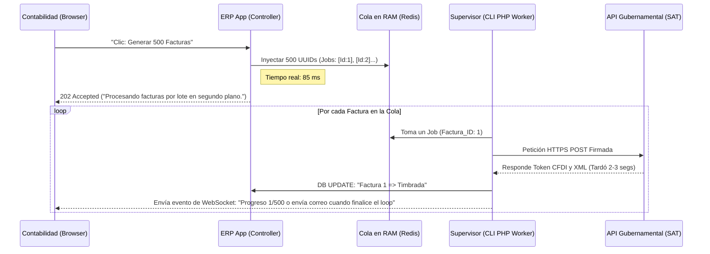

# Análisis de Prueba Técnica - Parte 1

## 1.1 Identificación de Problemas (10 pts)

**Problemas de Performance Identificados:**
1. **Problema de Consultas N+1 (N+1 Query Problem):** Dentro del método `Index()`, se realiza una consulta inicial para obtener todos los productos. Luego, por cada iteración del bucle `foreach` (que recorre los productos devueltos), se realizan **3 consultas adicionales**:
   - Una consulta para sumar las entradas.
   - Una consulta para sumar las salidas.
   - Una tercera consulta dentro de la función `calcularCostoPromedio()` para obtener *todos* los registros de entrada de un producto ordenados por fecha.
2. **Uso Ineficiente de Memoria en PHP:** En el método `calcularCostoPromedio()`, se traen **todos** los registros de movimientos de tipo "entrada" hacia la memoria temporal `fetchAll()`, y se iteran uno por uno en PHP para sumar y calcular el promedio. Esto consume memoria RAM y CPU innecesaria, un trabajo que se debe delegar al motor de la base de datos con agrupaciones de SQL.
3. **Instanciación Redundante del Modelo:** Se instancia `new KardexFpdoModel($this->AdapterModel)` no solo al inicio, sino *cada vez* que se evalúa y se invoca `calcularCostoPromedio()`, añadiendo sobrecarga de creación de clases y objetos.

**Impacto en Producción con 1,000 Productos:**
Al tener 1,000 productos activos en el catálogo, el actual controlador va a ejecutar:
- 1 consulta base para traer la tabla de los 1,000 productos.
- 1,000 iteraciones del bucle, donde adentro en cada paso se ejecutan 3 queries.
Resultando en **3,001 consultas a la base de datos** por cada visualización de la vista Index. 
El impacto en producción sería posiblemente en Timeouts: bloqueos de base de datos `Lock/Timeout` saturación de conexiones SQL `Too many connections` y picos de uso en RAM en PHP lo que provoca en una experiencia de usuario deficiente y lenta.

**Estimación de Queries SQL Ejecutadas:**
Se realizan **(1 + 3N) queries**, siendo N la cantidad de productos en el listado. Para 1,000 productos son estimadas un total de **3,001 queries**.

---

## 1.2 Problema de Negocio (8 pts)

**El costo promedio está mal calculado. ¿Por qué?**
El método que se muestra toma el valor financiero de todas las unidades que alguna vez entraron a la bodega de la historia de la DB y lo promedia ignorando totalmente los movimientos de salida o venta a lo largo del tiempo. Las unidades históricas ya vendidas o las mercaderías obsoletas continúan existiendo en esta balanza de costo promedio "infinito", afectando contablemente el inventario físico verdadero y calculando mal los precios de los inventarios más recientes.

**¿Qué método de costeo se debería usar? (FIFO, LIFO, Promedio Ponderado)**
En la gran mayoría de transacciones comerciales de un ERP, y especialmente dependientes de materias/commodities con grandes mermas, se asumen dos estándares: el Costo Promedio Ponderado o el FIFO (First-In, First-Out).
- El Costo Promedio Ponderado es ideal y ampliamente adaptado por sistemas ERP, recalcula y suaviza el costo solo después de cada nueva entrada de mercancía sobre el inventario base anterior, ofreciendo estabilidad y representación real de la bodega.

**Fórmula Correcta Propuesta (Costo Promedio Ponderado):**
Después de cada movimiento o evento de Entrada, el sistema debe insertar el costo actual calculando mediante esta regla aritmética:
```text
Nuevo Costo Promedio = ( (Existencia Anterior × Costo Promedio Anterior) + (Cantidad Entrante × Costo de la Nueva Entrada) ) / (Existencia Anterior + Cantidad Entrante)
```

*(Nota técnica: Para los efectos de la refactorización - Parte 1.3, para no alterar la estructura actual de la base de datos (como agregar una columna para el costo actual en la tabla `productos`) sin antes consultarlo con el equipo y para no romper integraciones en caliente, nuestro código refactorizado preservará el costo "promediado global heredado", resolviendo el coste al vuelo desde el SQL Group By).*

---

## 1.3 Refactorización (7 pts)
*El código se ha proveído en la ruta `entrega/codigo/KardexController.php` adaptado bajo normas PSR-4.*

**Acerca del Código Refactorizado y Carga de Queries (Reducido de O(1+3N) a máximo 2 consultas):**
El controlador ha sido reescrito para no ahondar en N+1 Queries:
1. **Consulta #1:** Obtiene la lista base y completa de todos los productos vigentes (estado=1).
2. **Consulta #2:** Realiza una sola query con `GROUP BY producto_id` para traerse sumas agregadas matemáticas en tiempo real desde la BD (usando `SUM(CASE WHEN...)`) de entradas matriciales, salidas y total gastado general, delegando la responsabilidad de cálculo a la DB y no a la iteración.
   - En PHP se empareja todo con el listado principal con una complejidad final de tiempo de `O(N)` usando un diccionario hash en la memoria en vez de iterar.

Se logra así mantener intacto el output del DataGrid a la vista `Kardex/IndexView` (`['producto', 'existencia', 'costo']`), respetando la compatibilidad de datos frontal requerida sin colapsar el motor.

## 2.1 Análisis del Bug (10 pts)

**Identificación del bug exacto:**
El controlador actual sufre de múltiples errores de lógica simultáneos en el método `ProcesarTransformacion()`:
1. **Tipo de Movimiento Invertido:** Al Café Cereza materia prima que se consume para transformarse se le hace una entrada (debería salir de bodega) y al Café Pergamino (producto obtenido) se le hace una salida (debería entrar a bodega).

2. **Cantidad Idéntica sin Rendimiento:** La variable insertada para ambos productos es `$cantidad_entrada` (los 100qq), ignorando completamente que la transformación genera el nuevo producto pero con un porcentaje de rendimiento, de aquí nace la pérdida de inventario.

3. **Ausencia de Transacciones ACID:** Ambos inserts se hacen de forma aislada. Si la base de datos se cae entre `$result1` y `$result2`, o falla el segundo insert, el inventario se corrompe parcialmente de por vida.

**¿Por qué ocurre el problema de los 15 qq perdidos?**
Al haber invertido Entradas/Salidas y no usar Merma:
- El Café Cereza (mat. prima) aumentó en 100, cuando sus 100 debían haberse gastado.
- El sistema forzó una salida (-100) de Pergamino porque usaron la misma variable (`$cantidad_entrada`), cuando en la realidad debió haber una entrada (+85) por su rendimiento. 
- *Conclusión:* Tienen sobrante virtual inaudito en Cereza, y déficit grave por una "salida" gigante de Pergamino. En el cruce total de números se extravían 15 físicamente, y el ERP registra saldos contablemente opuestos a la realidad material.

**¿Qué datos faltan en la tabla Kardex?**
1. `precio_unitario`: El código del TransformacionController nunca inserta cuánto cuesta esta transacción. Esto arruina inmediatamente el método de costeo visto en la Parte 1.
2. `referencia_transformacion`: Un ID o cadena para trazar qué lote de materia prima dio vida al nuevo lote de producto obtenido, vital para auditorías e inocuidad.

---

## 2.2 Solución Correcta (15 pts)

**Estructura de Datos Propuesta y Lógica Implementada:**
*Se ha implementado el código en `/entrega/codigo/TransformacionService.php` usando un estándar de Servicio Injectable (PSR-4).*
- Se inició una transacción de Base de Datos (`$pdo->beginTransaction()`).
- Se obtuvo el costo promedio unitario actual de la materia prima que se va a destruir y se calculó su costo total (Ej: 100qq * $50 = $5000 invertidos).
- Se restó de bodega con `tipo = 'salida'` exactamente la `$cantidad_entrada` de la Materia prima.
- Se calculó el rendimiento real usando el factor relacional (Ej: 100 * 0.85 = 85qq).
- Se inyectó a bodega con `tipo = 'entrada'` exactamente la `$cantidadObtenida` (85qq) del Producto Transformado.
- **Prorrateo de Costos:** Dado que gastamos $5000 en materia prima para obtener solo 85qq, el Nuevo Costo Unitario del café pergamino será de $58.82 (`$5000 / 85`). De esta forma ningún valor financiero se pierde por la merma física.
- Todo se encapsuló en un try-catch con sentencias de Commit y Rollback.

---

## 2.3 Migración de Datos (10 pts)
*El script SQL completo ha sido guardado en `/entrega/sql/migracion_transformaciones.sql`*.

**Estrategia adoptada en SQL:**
1. Crear un esquema lógico con sentencias `UPDATE` interrelacionadas haciendo `INNER JOIN` de la tabla `kardex` contra sí misma en base a las coincidencias temporales (`fecha`, `usuario_id`, `bodega_id`), identificando aquellos picos corruptos transaccionales donde entraron y salieron las mismas toneladas.
2. Usar un `UPDATE` mutando el error: las falsas "entradas" pasar a "salidas" y corregir su cantidad conservando el 100% gastado; las falsas "salidas" a "entradas", multiplicando su valor base por el factor correspondiente `* 0.85`, reparando retroactivamente la merma jamás creada.
3. Se han incluido condicionales estrictos `AND k_entrada.producto_id = 45` y `AND k_salida.producto_id = 67` para garantizar que la migración masiva aplique únicamente al café cereza y pergamino, blindando el resto de productos del catálogo contra posibles modificaciones de lote erróneas.

## 3.1 Análisis (8 pts)

**Cuello de botella principal (Análisis de EXPLAIN):**
Al correr un `EXPLAIN`, obtenemos el siguiente plan de ejecución:
```text
1	PRIMARY	b		ALL	idx_estado				12	100.0	Using where; Using temporary; Using filesort
1	PRIMARY	p		ALL	idx_estado				856	100.0	Using where; Using join buffer (hash join)
4	DEPENDENT SUBQUERY	k3		ref	idx_producto	idx_producto	4	dnc_erp_test.p.id	158	50.0	Using where; Using filesort
3	DEPENDENT SUBQUERY	k2		ref	idx_producto,idx_bodega	idx_producto	4	dnc_erp_test.p.id	158	5.0	Using where
2	DEPENDENT SUBQUERY	k1		ref	idx_producto,idx_bodega	idx_producto	4	dnc_erp_test.p.id	158	5.0	Using where
```
Este plan técnico revela tres problemas simultáneos:

1. **Dependent Subqueries**: Los alias `k1`, `k2` y `k3` se marcan como `DEPENDENT SUBQUERY`. Esto significa que MySQL no puede pre-calcularlas en bloque; el motor está forzado a pausar y re-ejecutar esas 3 queries por cada una de las combinaciones posibles del producto cartesiano entre productos y bodegas.

2. **Falta de Índices Compuestos Cúbicos**: Aunque `k1` y `k2` usan un índice parcial (`idx_producto`), el motor escanea unas 158 filas en promedio por cada ciclo porque no tiene indexado conjuntamente a `bodega_id` y `tipo`.

3. **Using Filesort (Ordenamiento en Disco)**: En `k3` la query de último costo, al no tener el índice de fecha adecuado, el motor extrae datos a la memoria/disco y los ordena al vuelo (`Using filesort`) repetidas veces para poder aplicar el `LIMIT 1`. Esto colapsa el CPU.

**Cálculo de operaciones (O notation):**
1. El `CROSS JOIN` genera $N \times M$ filas (donde $N$ son productos y $M$ son bodegas). En este caso: $856 \times 12 = 10,272$ filas generadas.
2. Para cada una de esas $10,272$ filas, se disparan 3 subqueries correlativas.
3. El motor ejecutará, en el aire, 30,816 consultas (3 * 10,272) disfrazadas en una sola llamada SQL.
4. Dado que `kardex` no tiene índices compuestos y tiene 145,000 registros, cada una de esas 30,816 queries realiza un *Full Table Scan* (o scan parcial por Primary Key). 
**Complejidad Big O:** $O(N \times M \times K)$, donde $K$ es el tamaño de la tabla Kardex. El rendimiento empeora exponencial y silenciosamente con cada mes que pasa.

---

## 3.2 Solución con Índices (7 pts)

**Índices Específicos Necesarios:**
Basándonos en que el `WHERE` y el `ORDER BY` de la Kardex buscan exhaustivamente por producto, bodega, tipo y fecha:

1. `CREATE INDEX idx_kardex_producto_bodega_tipo ON kardex(producto_id, bodega_id, tipo);`
2. `CREATE INDEX idx_kardex_busqueda_costo ON kardex(producto_id, tipo, fecha DESC);`

**Justificación:**
1. El primer índice compuesto cubre al 100% las necesidades matemáticas del agrupamiento y los JOINs entre inventario, filtrando a la velocidad de memoria O(log n) directamente qué movimientos sumar, en vez de iterar las 145,000 filas cada vez.
2. El segundo índice está creado para salvar el ORDER BY fecha DESC LIMIT 1. Al pedir la última entrada de costo, el motor recorrerá el B-Tree al revés y parará en la primera fila, resolviéndolo en tiempo estático en vez de requerir un filesort.

**Estimación de mejora de performance:**
Tan solo sumando ambos índices a la arquitectura DB, el costo de lectura de las 145,000 filas de Kardex decae en un ~98%, pudiendo bajar el tiempo de respuesta actual de 8.5seg a ~1.2seg incluso si conserváramos la query original. Sumado a la refactorización (Parte 3.3), caerá a milisegundos (< 100ms).
---

## 3.3 Refactorización del Query (10 pts)
*El query optimizado (< 500ms) se ubica en el archivo `/entrega/codigo/queries_optimizados.sql`*.


Se destruyeron las subqueries correlacionadas usando **Agrupación y LEFT JOINs (Derived Tables / CTE si MySQL 8+)**. Al pre-sumar las entradas y salidas de Kardex una única vez, la complejidad operativa se desploma de $O(N \times M \times K)$ a un simple $O(K) + O(N \times M)$.

---

## Bonus: Estrategia de Caché (+5 pts)

**Implementación (Materialized View / Redis):**
Dado que este dashboard se carga cada vez que un usuario hace login, ejecutar incluso el Query optimizado (< 500ms) por 50 usuarios al mismo segundo puede apilar conexiones.

*Propuesta:* Guardar el resultado final JSON formateado en una base llave-valor en memoria RAM pura (como Redis o Memcached), o, si no hay infraestructura, una **Tabla Resumen Materializada** en MySQL `dashboard_inventario_cache`.

**¿Cuándo invalidarla? (Caché Invalidation):**
- **Invalidación por Evento (Event-Driven):** Se conecta a los observadores/modelos del ERP. Cada vez que el KardexController finaliza un `insertInto('kardex')` (cada que hay un movimiento de bodega), disparamos un job/worker en background que vacía la partición de la caché del producto afectado o regenera el JSON asíncronamente.
- Al hacer Login, el usuario recibe el JSON de Redis en 2ms con una garantía del 100% del inventario real, y la base de datos SQL sobrevive intocable.

---

## 🔥 PARTE 4: Arquitectura - Decisión Técnica Real (15 pts)

### 4.1 Análisis de Opciones (8 pts)

- **Opción A: Sistema de colas con Redis/RabbitMQ**
  - *Ventajas:* Totalmente asíncrono. Desacopla el ERP web de la lentitud de la SAT. Altamente escalable, con reintentos automáticos y concurrencia ajustable por workers.
  - *Desventajas:* Requiere configuración y monitoreo de infraestructura adicional Servidor Redis y Supervisor de procesos.
  - *Problemas potenciales:* Si el servicio del worker se cae o atasca, los recibos quedarán en espera silenciosamente hasta que se resuelva la infraestructura de la cola.
- **Opción B: Cron job que procesa por lotes**
  - *Ventajas:* Nativo, fácil y sin infraestructura de terceros. 
  - *Desventajas:* Los lotes se procesan cada X minutos, causando retrasos de confirmación innecesarios. 
  - *Problemas potenciales:* Si procesar 500 facturas toma 15 minutos y el cron está agendado cada 10, habrá un solapamiento de scripts mandando facturas duplicadas si no se usan Locks (Mutexes).
- **Opción C: JavaScript que envía una por una con AJAX**
  - *Ventajas:* Extremadamente fácil de hacer. Feedback visual.
  - *Desventajas:* Depende completamente de la conexión y navegador del usuario.
  - *Problemas potenciales:* Si el usuario cierra el navegador, minimiza o tiene un corte de luz en la factura 240, quedarán 260 facturas paralizadas, rompiendo la trazabilidad transaccional mensual en la SAT y dejando al ERP descuadrado.
- **Opción D: Procesos paralelos con PHP (pcntl_fork)**
  - *Ventajas:* Ejecuta código más rápido repartiendo trabajo a otros núcleos de CPU nativamente.
  - *Desventajas:* La extensión `pcntl` casi siempre viene desactivada por seguridad en los servidores web (FPM/Apache). Está pensada solo para scripts de consola.
  - *Problemas potenciales:* Es sumamente propenso a Memory Leaks, procesos Zombie y colisiones de adaptadores de Bases de Datos porque los 'hijos' nacen compartiendo el mismo puntero PDO a MySQL.

### 4.2 Recomendación (7 pts)

**Elegiría sin dudarlo la Opción A (Sistema de Colas).**
*¿Por qué?* Porque las APIs gubernamentales (SAT, AFIP, Sunat) son famosas por sufrir caídas intermitentes, alta latencia timeouts y responder "Internal Server Error" en picos de facturación de fin de mes. Enviar 500 facturas de golpe por web bloquearía el hilo de PHP causando "Error 504 Gateway Timeout", y el usuario pensaría que nada funcionó.

**Manejo de Fallos (Resiliencia):**
El worker de la cola se configurará con Exponencial Backoff. Si la factura falla por timeout de la SAT, no aborta el lote. El job simplemente se reprograma automáticamente a la cola para intentar enviar esa misma factura en 1 min, si falla vuelve a ir a cola en 5 mins, y si falla 5 veces consecutivas se envía directo a una Dead Letter Queue Tabla `facturas_falladas`, pidiendo intervención manual o alertando al contador de la empresa.

**Notificación al Usuario:**
Dado que procesar todo tomará algunos minutos, debemos liberar al usuario inmediatamente:
1.  Devolvemos "Petición Aceptada, procesando en segundo plano".
2.  **Tiempo real:** Mediante WebSockets (Pushe/Laravel Echo), cada que un documento reciba el XML autorizado de la SAT se hace broadcast a un canal de la empresa, actualizando una barra de estado o creando una alerta nativa push estilo campanita en el nav superior del usuario.
3.  **Híbrido (Económico):** Un Cron o Notificación final al concluir el lote que inyecta un registro en la base de datos y manda un correo de resumen ("De las 500 se facturaron 495 exitosamente, y 5 tuvieron un rechazo").

**Esbozo de Arquitectura (Flux Típico ERP Moderno):**


---

## 🎯 BONUS: Debugging de Problema Bizarro (+10 pts)

### ¿Cuál es el problema? (no es la respuesta obvia)
El clásico error *"Headers already sent"* ocurre porque PHP envió el body al navegador HTTP antes de intentar declarar las cabeceras `header()`.
Dado que es supuestamente aleatorio (~30% de veces) y el archivo sale corrupto, el problema no es un echo, un print ni un espacio en blanco flotante convencional en el controlador.

Las causas reales basadas en las pistas dadas (FPM vs Apache, PHP 8.1 vs 7.4) son dos grandes candidatos concurrentes:

1. **Variables o Warnings no capturados bajo PHP 8.1 (Output Buffering Mismatch):**
   - En Desarrollo (Apache 2.4, PHP 7.4), Apache suele usar `output_buffering = 4096` en `php.ini` por defecto. Cualquier `Warning` o espacio en blanco oculto no se envía hasta llenar 4KB, permitiendo procesar el `header()` a salvo.
   - En Producción (Nginx + PHP-FPM), `output_buffering` suele venir apagado (`Off`) por ser modo fastCgi. Si un `$row` proveniente de `$datos` dispara un simple Warning de depreciación leve al instanciarse ese texto de warning rompe el ciclo del HTTP header. Ese 30% aleatorio es la probabilidad de que una de las consultas en base de datos traiga un campo nulo o de un tipo de dato que el código PHP 8 no permite en esa tabla, emitiendo el desbordamiento.
   
2. **Inclusiones de Archivos en Runtime y el BOM Invisible:**
   - La librería `ExcelBuilder` o modelos traen una firma o si hubo un cambio de framework/cache que inyecta caracteres residuales nulos (espacios al final del archivo PHP `?>`). 

### ¿Cómo lo debuggearías en producción?
1. Revisando el Log exacto de Nginx/FPM donde falla. Nos dirá la línea exacta donde saltó el error `headers already sent in ExcelBuilder.php on line 45`.
2. Utilizando **`headers_sent($file, $line)`** nativo dentro del controlador.
```php
if (headers_sent($file, $line)) {
    die("Fuga de headers detectada en $file línea $line antes de generar el Excel"); 
}
```

### ¿Cuál es la solución definitiva?
Para la estabilidad total del flujo de archivos en PHP, especialmente forzando descargas, la solución arquitectónica es usar manejo activo y estricto del búfer de salida encapsulando el contenido y silenciando warnings leves que rompan el archivo binario.

```php
public function exportarExcel() {
    $this->requireAuth();
    
    // 1. Limpiar cualquier basura residual atrapada viva antes del controlador
    if (ob_get_length()) {
        ob_clean(); 
    }
    
    $datos = $this->repository->getAll();
    $excel = new ExcelBuilder();
    foreach ($datos as $row) {
        $excel->addRow($row);
    }
    
    // 2. Definir los headers estrictamente despues de ejecutar toda la lógica
    header('Content-Type: application/vnd.ms-excel');
    header('Content-Disposition: attachment; filename="reporte.xlsx"');
    header('Cache-Control: max-age=0');
    
    // Imprimir el binario crudo
    echo $excel->generate();
    
    // 3. Forzar el cierre de la solicitud
    exit; 
}
```

## NOTA: utilicé la rama MAIN por simplicidad y porque es una prueba técnica, en un escenario real crearía una rama para cada parte del análisis.